# Quick Reproduction

The model of EarSpeech is released in [model](./model/) 

We also release the pre-trained model in [model](./model/) 

**References**: huyanxin's [phasen](https://github.com/huyanxin/phasen/tree/master)

# Demo of Earspeech

EarSpeech is an earphone-based speech enhancement system that leverages outer and inner microphones on the same earphone to capture sound vibrations propagating along airborne and in-ear channels. The key idea of EarSpeech is that in-ear speech is less sensitive to ambient noise and exhibits a correlation with airborne speech which is sensitive to ambient noise. The goal of EarSpeech is to fuse the in-ear channel to improve the quality and intelligibility of airborne speech. Here, we release some  audio demo samples to demonstrate the performance of EarSpeech. 

# 1. Description

The structure of the folder is shown as follows:

 	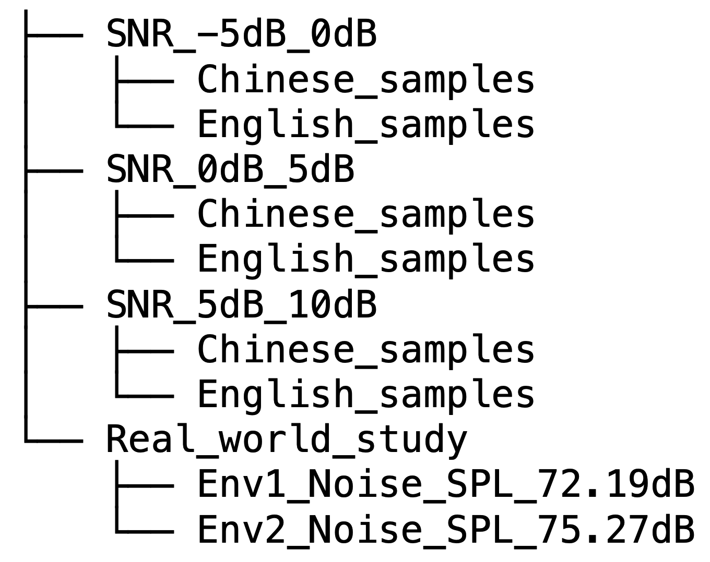 

- "SNR_-5dB_0dB", "SNR_0dB_5dB", and "SNR_5dB_10dB" represent the SNR of noisy airborne speech ranges from [-5, 0] dB, [0, 5] dB, and [5, 10] dB, respectively.  "Chinese_samples" and "English_samples" represent the speech in Chinese and English respectively.
- "Read_world_study" represents the speech collected in noisy real-world environments ( noise SPLs of the two environments are 72.19 dB and 75.27 dB respectively).

# 2. Demo

We first show the comparison between  ***(1) clean airborne speech (reference)***, ***(2) corresponding in-ear speech***, ***(3) noisy airborne speech (mixing clean speech with various noise)***, and ***(4) enhanced airborne speech***

## 2.1 SNR_-5dB_0_dB

### 2.1.1 Chinese samples [Audio files are seen in [audioDemo](./SNR_-5dB_0dB/Chinese_samples/) ]

 	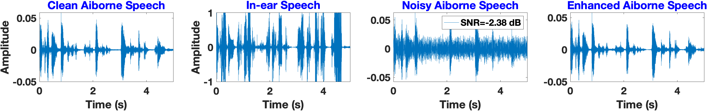 

 	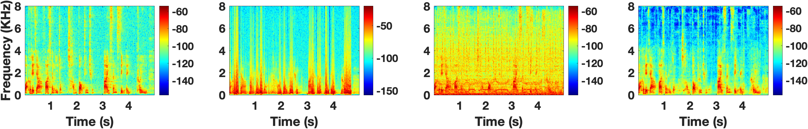 

### 2.1.2 English samples [Audio files are seen in [audioDemo](./SNR_-5dB_0dB/English_samples/) ]

 	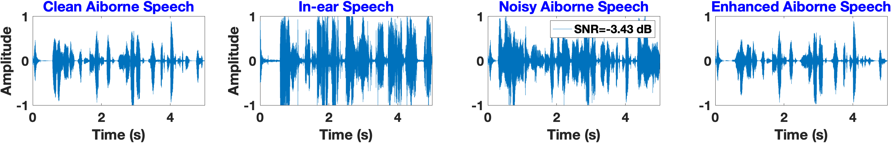 

 	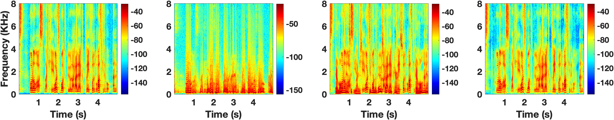 

## 2.2 SNR_0dB_5_dB

### 2.2.1 Chinese samples [Audio files are seen in [audioDemo](./SNR_0dB_5dB/Chinese_samples/) ]

 	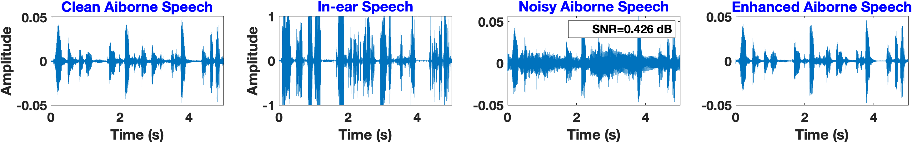 

 	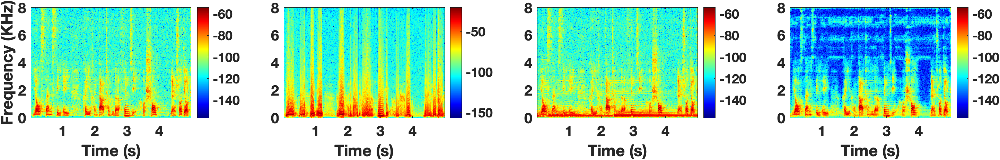 

### 2.2.2 English samples [Audio files are seen in [audioDemo](./SNR_0dB_5dB/English_samples/) ]

 	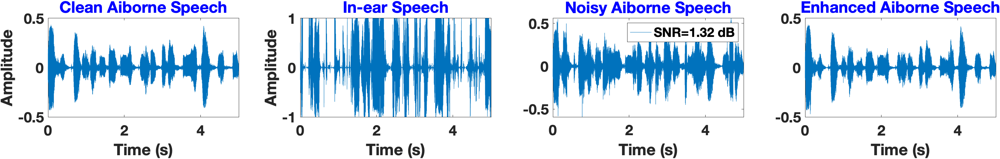 

 	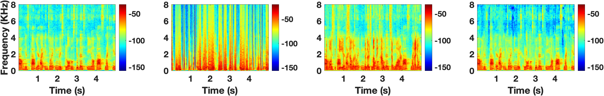 

## 2.3 SNR_5dB_10_dB

### 2.3.1 Chinese samples [Audio files are seen in [audioDemo](./SNR_5dB_10dB/Chinese_samples/) ]

 	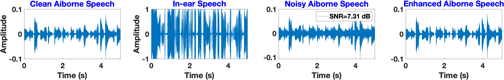 

 	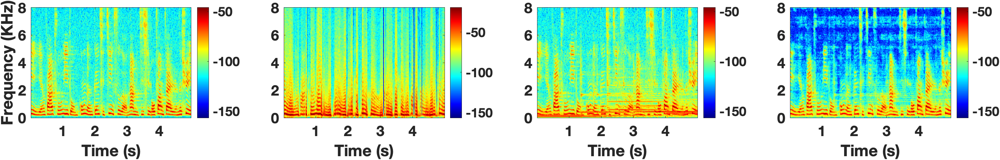 

### 2.3.2 English samples [Audio files are seen in [audioDemo](./SNR_-5dB_0dB/English_samples/) ]

 	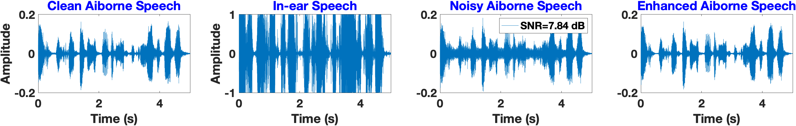 

 	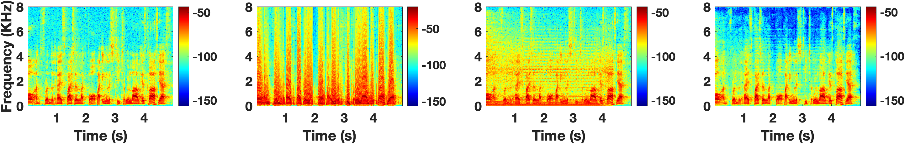 

## 2.4 Real_world_study

### 2.3.1 Env1_Noise_SPL_72.19dB [Audio files are seen in [audioDemo](./Real_world_study/Env1_Noise_SPL_72.19dB/) ]

 	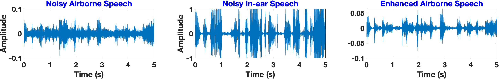 

 	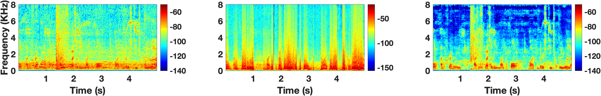 

### 2.3.2 Env2_Noise_SPL_75.27dB [Audio files are seen in [audioDemo](./Real_world_study/Env2_Noise_SPL_75.27dB/) ]

 	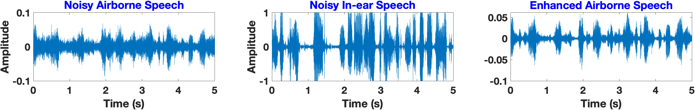 

 	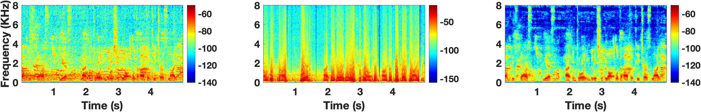 

